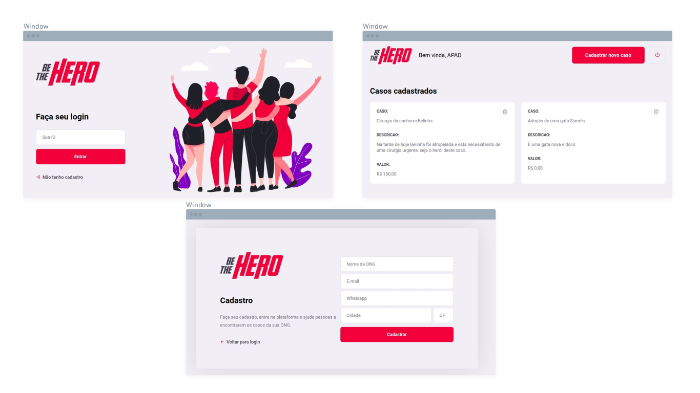

<h1 align="center">
    
</h1>

A aplicação consiste em um ambiente onde pessoas dispostas a ajudar podem escolher casos que ONGs ou pessoas tenham cadastrado no site.

<h1 align="center">
    
</h1>

## Execução 💻
 - Rodar os seguintes comandos, em ambas as pastas: backend e frontend. 
 	- npm install
	- npm start
	
## Tecnologias usadas 🛠
- Back-end:
	- NodeJS 
	- Knex
- Front-end:
	- ReactJS
	- HTML
	- CSS
	- Bootstrap

